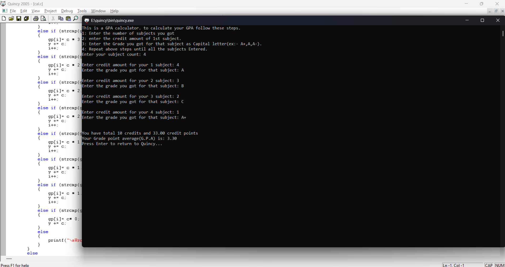

# This is a c proggramming code file that can calculate your GAP easily.
 i just use arrays, function and basic c programming syntax to make this.

 you can calculate your gpa by entering your subject count, credit amount each subject holds and the grade you have for that particular subject.

 i just code this and run by quincy 2005 very old platform.
 
 i will post a example here.
 
